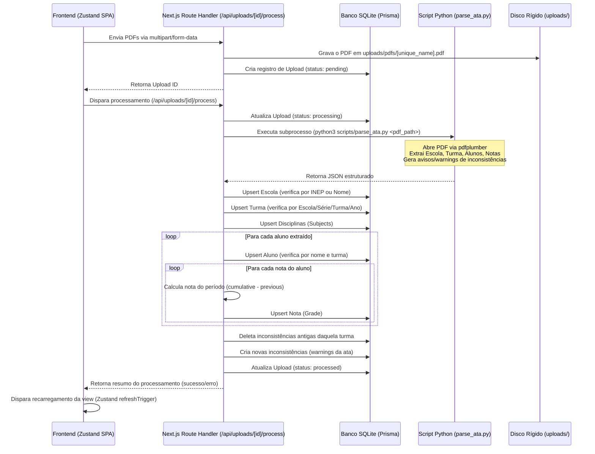
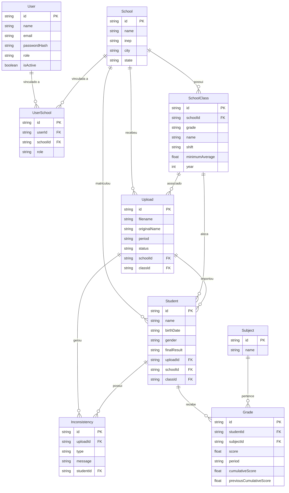

# 📐 Especificação Arquitetural | colaboraEDU Analytics

Este documento descreve a arquitetura técnica, modelo de dados, infraestrutura e fluxos de dados do colaboraEDU Analytics.

---

## 1. Visão Geral da Arquitetura

O sistema é construído como uma aplicação monolítica utilizando **Next.js 16** (React 19), com APIs no backend (*Route Handlers*) e uma interface de página única (*Single Page Application*) controlada por estado global no frontend. Para processamento pesado de extração de dados de PDFs, o backend Next.js interage de forma síncrona via subprocesso com um script **Python 3** independente.

```
┌─────────────────────────────────────────────────────────┐
│                    Navegador Web                        │
│   (Frontend SPA: React 19 + Zustand + Tailwind CSS)     │
└────────────┬─────────────────────────────▲──────────────┘
             │ Chamadas HTTP API           │ Respostas JSON
             ▼                             │
┌──────────────────────────────────────────┴──────────────┐
│                  Next.js API Handler                    │
│        (src/app/api/ e src/middleware.ts)               │
└────────────┬─────────────────────────────▲──────────────┘
             │                             │
             │ execFileSync                │ Retorna JSON
             ▼                             │
┌───────────────────────────┐ ┌────────────┴──────────────┐
│   Script Python Parser    │ │        Prisma ORM         │
│   (scripts/parse_ata.py)  │ │   (prisma/schema.prisma)  │
└────────────┬──────────────┘ └────────────┬──────────────┘
             │                             │
             ▼ pdfplumber                  ▼ SQL Queries
┌───────────────────────────┐ ┌───────────────────────────┐
│     Atas PDF em disco     │ │    Banco de Dados SQL     │
│       (uploads/)          │ │    (SQLite / Postgres)    │
└───────────────────────────┘ └───────────────────────────┘
```

---

## 2. Fluxo de Dados: Processamento de PDF

O diagrama de sequência a seguir ilustra o ciclo completo de upload e ingestão de dados pedagógicos:



---

## 3. Modelo de Dados (Relacionamento de Entidades)

O schema do banco de dados está modelado no Prisma e reflete a estrutura hierárquica escolar do Brasil, vinculando usuários a escolas de forma multinível e mantendo o histórico de notas e auditorias de inconsistências acadêmicas.



### Principais Entidades e Regras de Negócio:
1. **User e UserSchool:** Gerenciam permissões de escopo. Um usuário com perfil que não seja `SUPER_ADMIN` ou `ADMIN` só pode acessar dados pedagógicos se estiver associado à escola através da tabela intermediária `UserSchool`.
2. **SchoolClass:** Modela a turma escolar. A unicidade é garantida pela combinação de `[schoolId, grade, name, shift, year]`.
3. **Upload:** Controla a fila e o histórico de processamento dos arquivos. Cada processamento gera novos alunos ou atualiza alunos existentes.
4. **Grade:** Armazena as notas individuais. Guarda a nota líquida calculada para o período letivo (`score`) e as notas acumuladas (`cumulativeScore` e `previousCumulativeScore`) usadas para a lógica incremental.
5. **Inconsistency:** Tabela de auditoria que aponta os erros detectados pelo processador de PDF nas regras BNCC.

---

## 4. Infraestrutura de Deploy e Produção

O projeto está configurado para publicação em um servidor VPS Linux dedicado sob o domínio `https://analytics.colaboraedu.cloud` utilizando:

- **Cloudflare DNS & Proxy:** Encaminha requisições seguras HTTPS para a VPS com certificado SSL no modo *Full (strict)*.
- **Caddy (Reverse Proxy):** Escuta na porta `80` e `443` e atua como proxy reverso local, redirecionando o tráfego HTTP para o servidor Next.js standalone rodando na porta interna `3005`.
- **Systemd Service (`analytics-colaboraedu.service`):** Gerencia a inicialização, paradas e reinicializações automáticas do processo Node.js standalone do Next.js.
- **SQLite local (`db/custom.db`):** Banco relacional em arquivo local na VPS.

---

## 5. Mapeamento da Ingestão de Notas Incrementais

A nota pedagógica do conselho de classe ou do boletim é cumulativa por trimestre. O cálculo é feito dinamicamente no backend Next.js pela função `getScoreForUploadPeriod` localizada em [route.ts](file:///home/suporte/colaboraEDUanalytics/src/app/api/uploads/%5Bid%5D/process/route.ts):

- **1º Trimestre (`TRIMESTER_1`):** A nota do período é exatamente a nota que vem no PDF.
- **2º Trimestre (`TRIMESTER_2`):** Exige que o 1º Trimestre já esteja processado. Nota do Período = (Nota Acumulada do 2º Trimestre) - (Nota Acumulada do 1º Trimestre).
- **3º Trimestre (`TRIMESTER_3`):** Exige o 2º Trimestre processado. Nota do Período = (Nota Acumulada do 3º Trimestre) - (Nota Acumulada do 2º Trimestre).
- **Resultado Final (`FINAL_RESULT`):** Exige o 3º Trimestre processado. Nota do Período = (Nota Acumulada Final) - (Nota Acumulada do 3º Trimestre).
